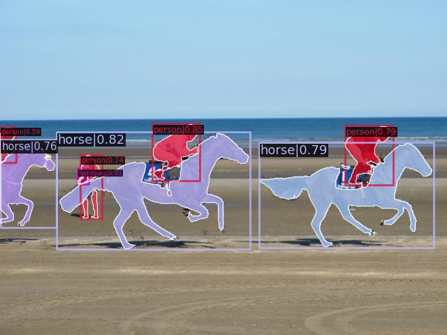
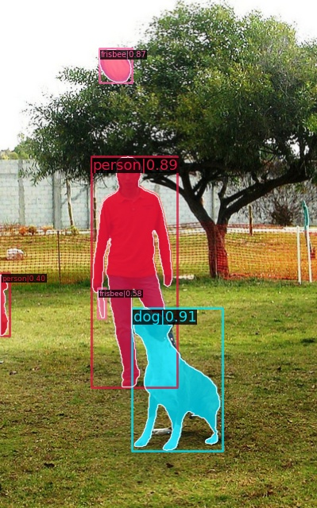
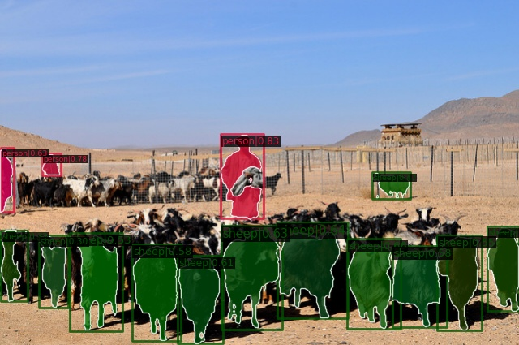
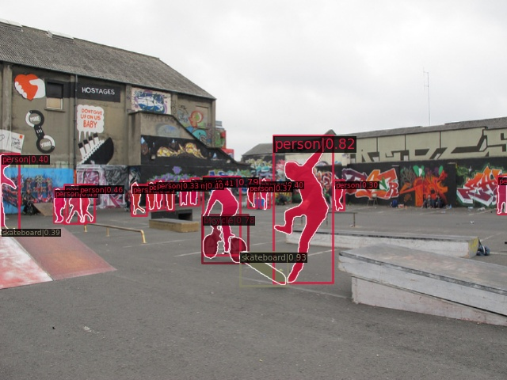
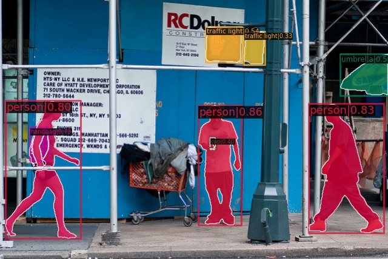

# Prompt-Segment-Anything
This is an implementation of zero-shot instance segmentation using [Segment Anything](https://github.com/facebookresearch/segment-anything). Thanks to the authors of Segment Anything for their wonderful work! 

This repository is based on [MMDetection](https://github.com/open-mmlab/mmdetection) and includes some code from [H-Deformable-DETR](https://github.com/HDETR/H-Deformable-DETR) and [FocalNet-DINO](https://github.com/FocalNet/FocalNet-DINO).



## News

**2023.04.12** Multimask output mode and cascade prompt mode is available now.

**2023.04.11** Our [demo](https://huggingface.co/spaces/rockeycoss/Prompt-Segment-Anything-Demo) is available now. Please feel free to check it out.

**2023.04.11** [Swin-L+H-Deformable-DETR + SAM](https://github.com/RockeyCoss/Instance-Segment-Anything/blob/master/projects/configs/hdetr/swin-l-hdetr_sam-vit-h.py)/[FocalNet-L+DINO + SAM](https://github.com/RockeyCoss/Instance-Segment-Anything/blob/master/projects/configs/hdetr/swin-l-hdetr_sam-vit-h.py) achieves strong COCO instance segmentation results: mask AP=46.8/49.1 by simply prompting SAM with boxes predicted by Swin-L+H-Deformable-DETR/FocalNet-L+DINO. (mask AP=46.5 based on ViTDet)🍺

## Catalog

- [x] Support Swin-L+H-Deformable-DETR+SAM
- [x] Support FocalNet-L+DINO+SAM
- [x] Support R50+H-Deformable-DETR+SAM/Swin-T+H-Deformable-DETR
- [x] Support HuggingFace gradio demo
- [x] Support cascade prompts (box prompt + mask prompt)

## Box-as-Prompt Results

|         Detector         |    SAM    |    multimask ouput    | Detector's Box AP | Mask AP |                            Config                            |
| :--------------------- | :-------: | :---------------: | :-----: | :----------------------------------------------------------: | ----------------------- |
|  R50+H-Deformable-DETR   | sam-vit-b | :x: |       50.0        |  38.2   | [config](https://github.com/RockeyCoss/Instance-Segment-Anything/blob/master/projects/configs/hdetr/r50-hdetr_sam-vit-b.py) |
| R50+H-Deformable-DETR | sam-vit-b | :heavy_check_mark: | 50.0 | 39.9 | [config](https://github.com/RockeyCoss/Instance-Segment-Anything/blob/master/projects/configs/hdetr/r50-hdetr_sam-vit-b_best-in-multi.py) |
|  R50+H-Deformable-DETR   | sam-vit-l | :x: |       50.0        |  41.5   | [config](https://github.com/RockeyCoss/Instance-Segment-Anything/blob/master/projects/configs/hdetr/r50-hdetr_sam-vit-l.py) |
| Swin-T+H-Deformable-DETR | sam-vit-b | :x: |       53.2        |  40.0   | [config](https://github.com/RockeyCoss/Instance-Segment-Anything/blob/master/projects/configs/hdetr/swin-t-hdetr_sam-vit-b.py) |
| Swin-T+H-Deformable-DETR | sam-vit-l | :x: |       53.2        |  43.5   | [config](https://github.com/RockeyCoss/Instance-Segment-Anything/blob/master/projects/configs/hdetr/swin-t-hdetr_sam-vit-l.py) |
| Swin-L+H-Deformable-DETR | sam-vit-b | :x: |       58.0        |  42.5   | [config](https://github.com/RockeyCoss/Instance-Segment-Anything/blob/master/projects/configs/hdetr/swin-l-hdetr_sam-vit-b.py) |
| Swin-L+H-Deformable-DETR | sam-vit-l | :x: |       58.0        |  46.3   | [config](https://github.com/RockeyCoss/Instance-Segment-Anything/blob/master/projects/configs/hdetr/swin-l-hdetr_sam-vit-l.py) |
| Swin-L+H-Deformable-DETR | sam-vit-h | :x: |       58.0        |  46.8   | [config](https://github.com/RockeyCoss/Instance-Segment-Anything/blob/master/projects/configs/hdetr/swin-l-hdetr_sam-vit-h.py) |
|     FocalNet-L+DINO      | sam-vit-b | :x: |       63.2        |  44.5   | [config](https://github.com/RockeyCoss/Instance-Segment-Anything/blob/master/projects/configs/hdetr/swin-l-hdetr_sam-vit-b.py) |
|     FocalNet-L+DINO      | sam-vit-l | :x: |       63.2        |  48.6   | [config](https://github.com/RockeyCoss/Instance-Segment-Anything/blob/master/projects/configs/hdetr/swin-l-hdetr_sam-vit-l.py) |
|     FocalNet-L+DINO      | sam-vit-h | :x: |       63.2        |  49.1   | [config](https://github.com/RockeyCoss/Instance-Segment-Anything/blob/master/projects/configs/hdetr/swin-l-hdetr_sam-vit-h.py) |

## Cascade-Prompt Results

|       Detector        |    SAM    |  multimask ouput   | Detector's Box AP | Mask AP | Config                                                       |
| :------------------- | :-------: | :----------------: | :---------------: | :-----: | ------------------------------------------------------------ |
| R50+H-Deformable-DETR | sam-vit-b |        :x:         |       50.0        |  38.8   | [config](https://github.com/RockeyCoss/Instance-Segment-Anything/blob/master/projects/configs/hdetr/r50-hdetr_sam-vit-b_cascade.py) |
| R50+H-Deformable-DETR | sam-vit-b | :heavy_check_mark: |       50.0        |  40.5   | [config](https://github.com/RockeyCoss/Instance-Segment-Anything/blob/master/projects/configs/hdetr/r50-hdetr_sam-vit-b_best-in-multi_cascade.py) |
| Swin-L+H-Deformable-DETR | sam-vit-h | :heavy_check_mark: |       58.0        |  47.3   | [config](https://github.com/RockeyCoss/Instance-Segment-Anything/blob/master/projects/configs/hdetr/swin-l-hdetr_sam-vit-h_best-in-multi_cascade.py) |
|     FocalNet-L+DINO      | sam-vit-h | :heavy_check_mark: |       63.2        |  49.6   | [config](https://github.com/RockeyCoss/Instance-Segment-Anything/blob/master/projects/configs/hdetr/swin-l-hdetr_sam-vit-h_best-in-multi_cascade.py) |

***Note***

**multimask ouput**: If multimask output is :heavy_check_mark:, SAM will predict three masks for each prompt, and the segmentation result will be the one with the highest predicted IoU. Otherwise, if multimask output is :x:, SAM will return only one mask for each prompt, which will be used as the segmentation result.

**cascade-prompt**: In the cascade-prompt setting, the segmentation process involves two stages. In the first stage, a coarse mask is predicted with a bounding box prompt. The second stage then utilizes both the bounding box and the coarse mask as prompts to predict the final segmentation result. Note that if multimask output is :heavy_check_mark:, the first stage will predict three coarse masks, and the second stage will use the mask with the highest predicted IoU as the prompt.

## Installation

🍺🍺🍺 Add dockerhub enviroment 

```
docker pull kxqt/prompt-sam-torch1.12-cuda11.6:20230410
nvidia-docker run -it --shm-size=4096m -v {your_path}:{path_in_docker} kxqt/prompt-sam-torch1.12-cuda11.6:20230410
```

We test the models under `python=3.7.10,pytorch=1.10.2,cuda=10.2`. Other versions might be available as well.

1. Clone this repository

```
git clone https://github.com/RockeyCoss/Instance-Segment-Anything
cd Instance-Segment-Anything
```

2. Install PyTorch

```bash
# an example
pip install torch torchvision
```

3. Install MMCV

```
pip install -U openmim
mim install "mmcv-full<2.0.0"
```

4. Install MMDetection's requirements

```
pip install -r requirements.txt
```

5. Compile CUDA operators

```bash
cd projects/instance_segment_anything/ops
python setup.py build install
cd ../../..
```

Please note that the ``mmdet`` package does not need to be installed. If your environment already has the ``mmdet`` package installed, you can run the following command before executing other scripts:

```bash
export PYTHONPATH=$(pwd)
```

## Prepare COCO Dataset

Please refer to [data preparation](https://mmdetection.readthedocs.io/en/latest/user_guides/dataset_prepare.html).

## Prepare Checkpoints

1. Install wget

```
pip install wget
```

2. SAM checkpoints

```bash
mkdir ckpt
cd ckpt
python -m wget https://dl.fbaipublicfiles.com/segment_anything/sam_vit_b_01ec64.pth
python -m wget https://dl.fbaipublicfiles.com/segment_anything/sam_vit_l_0b3195.pth
python -m wget https://dl.fbaipublicfiles.com/segment_anything/sam_vit_h_4b8939.pth
cd ..
```

3. Here are the checkpoints for the detection models. You can download only the checkpoints you need.

```bash
# R50+H-Deformable-DETR
cd ckpt
python -m wget https://github.com/HDETR/H-Deformable-DETR/releases/download/v0.1/r50_hybrid_branch_lambda1_group6_t1500_dp0_mqs_lft_deformable_detr_plus_iterative_bbox_refinement_plus_plus_two_stage_36eps.pth -o r50_hdetr.pth
cd ..
python tools/convert_ckpt.py ckpt/r50_hdetr.pth ckpt/r50_hdetr.pth

# Swin-T+H-Deformable-DETR
cd ckpt
python -m wget https://github.com/HDETR/H-Deformable-DETR/releases/download/v0.1/swin_tiny_hybrid_branch_lambda1_group6_t1500_dp0_mqs_lft_deformable_detr_plus_iterative_bbox_refinement_plus_plus_two_stage_36eps.pth -o swin_t_hdetr.pth
cd ..
python tools/convert_ckpt.py ckpt/swin_t_hdetr.pth ckpt/swin_t_hdetr.pth

# Swin-L+H-Deformable-DETR
cd ckpt
python -m wget https://github.com/HDETR/H-Deformable-DETR/releases/download/v0.1/decay0.05_drop_path0.5_swin_large_hybrid_branch_lambda1_group6_t1500_n900_dp0_mqs_lft_deformable_detr_plus_iterative_bbox_refinement_plus_plus_two_stage_36eps.pth -o swin_l_hdetr.pth
cd ..
python tools/convert_ckpt.py ckpt/swin_l_hdetr.pth ckpt/swin_l_hdetr.pth

# FocalNet-L+DINO
cd ckpt
python -m wget https://projects4jw.blob.core.windows.net/focalnet/release/detection/focalnet_large_fl4_o365_finetuned_on_coco.pth -o focalnet_l_dino.pth
cd ..
python tools/convert_ckpt.py ckpt/focalnet_l_dino.pth ckpt/focalnet_l_dino.pth
```

## Run Evaluation

1. Evaluate Metrics

```bash
# single GPU
python tools/test.py path/to/the/config/file --eval segm
# multiple GPUs
bash tools/dist_test.sh path/to/the/config/file num_gpus --eval segm
```

2. Visualize Segmentation Results

```bash
python tools/test.py path/to/the/config/file --show-dir path/to/the/visualization/results
```
## Gradio Demo

We also provide a UI for displaying the segmentation results that is built with gradio. To launch the demo, simply run the following command in a terminal:

```bash
pip install gradio
python app.py
```

This demo is also hosted on HuggingFace [here](https://huggingface.co/spaces/rockeycoss/Prompt-Segment-Anything-Demo).

## More Segmentation Examples






## Citation

**Segment Anything**

```latex
@article{kirillov2023segany,
  title={Segment Anything}, 
  author={Kirillov, Alexander and Mintun, Eric and Ravi, Nikhila and Mao, Hanzi and Rolland, Chloe and Gustafson, Laura and Xiao, Tete and Whitehead, Spencer and Berg, Alexander C. and Lo, Wan-Yen and Doll{\'a}r, Piotr and Girshick, Ross},
  journal={arXiv:2304.02643},
  year={2023}
}
```
**H-Deformable-DETR**

```latex
@article{jia2022detrs,
  title={DETRs with Hybrid Matching},
  author={Jia, Ding and Yuan, Yuhui and He, Haodi and Wu, Xiaopei and Yu, Haojun and Lin, Weihong and Sun, Lei and Zhang, Chao and Hu, Han},
  journal={arXiv preprint arXiv:2207.13080},
  year={2022}
}
```
**Swin Transformer**

```latex
@inproceedings{liu2021Swin,
  title={Swin Transformer: Hierarchical Vision Transformer using Shifted Windows},
  author={Liu, Ze and Lin, Yutong and Cao, Yue and Hu, Han and Wei, Yixuan and Zhang, Zheng and Lin, Stephen and Guo, Baining},
  booktitle={Proceedings of the IEEE/CVF International Conference on Computer Vision (ICCV)},
  year={2021}
}
```
**DINO**

```latex
@misc{zhang2022dino,
      title={DINO: DETR with Improved DeNoising Anchor Boxes for End-to-End Object Detection}, 
      author={Hao Zhang and Feng Li and Shilong Liu and Lei Zhang and Hang Su and Jun Zhu and Lionel M. Ni and Heung-Yeung Shum},
      year={2022},
      eprint={2203.03605},
      archivePrefix={arXiv},
      primaryClass={cs.CV}
}
```
**FocalNet**

```latex
@misc{yang2022focalnet,  
  author = {Yang, Jianwei and Li, Chunyuan and Dai, Xiyang and Yuan, Lu and Gao, Jianfeng},
  title = {Focal Modulation Networks},
  publisher = {arXiv},
  year = {2022},
}
```
